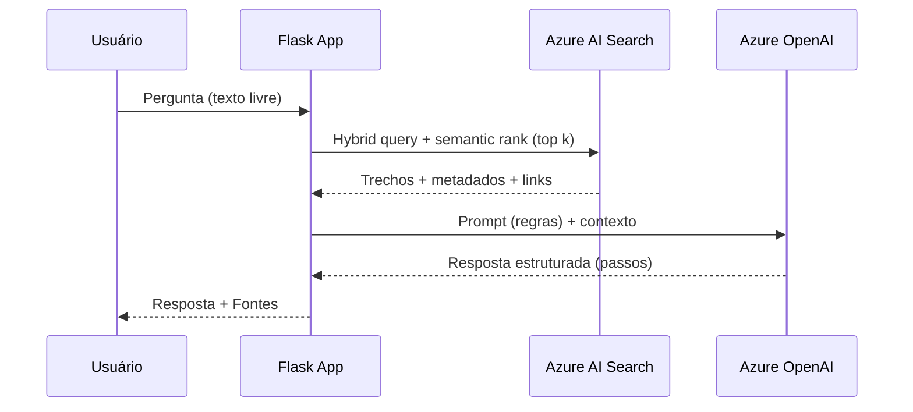
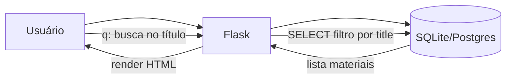
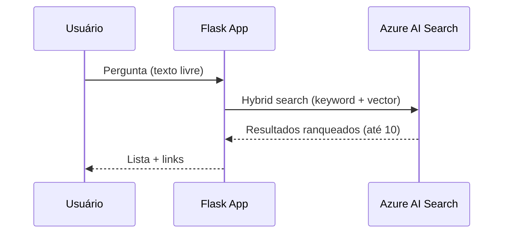

# Ecossistema Digital de Capacitação GRP (SEF/MG)

> **Documento técnico (README longo) — guia de implementação + diretrizes de arquitetura**
>
> Público-alvo: **desenvolvedor(a) júnior** com conhecimento básico de **Python/Flask**, **Git**, **Docker** e **Azure**.
>
> **MVP**: interfaces **1, 2, 6 e 8** (sem histórico de chat), com **POPs em .docx** e **links de vídeos do YouTube**.

---

## Sumário

- [1. Visão Geral](#1-visão-geral)
- [2. Funcionalidades do MVP (Interfaces)](#2-funcionalidades-do-mvp-interfaces)
- [3. Requisitos e Decisões do MVP](#3-requisitos-e-decisões-do-mvp)
- [4. Arquitetura (alto nível) + Diagramas Mermaid](#4-arquitetura-alto-nível--diagramas-mermaid)
- [5. Modelo de Dados (SQL) — catálogo central](#5-modelo-de-dados-sql--catálogo-central)
- [6. Organização do Repositório (estrutura de pastas)](#6-organização-do-repositório-estrutura-de-pastas)
- [7. Configuração Local (passo a passo)](#7-configuração-local-passo-a-passo)
- [8. Provisionamento na Azure (DEV e PROD) — passo a passo](#8-provisionamento-na-azure-dev-e-prod--passo-a-passo)
- [9. Azure Blob Storage na prática (para júnior)](#9-azure-blob-storage-na-prática-para-júnior)
- [10. Azure AI Search na prática (para júnior)](#10-azure-ai-search-na-prática-para-júnior)
- [11. RAG na prática (para júnior)](#11-rag-na-prática-para-júnior)
- [12. Testes (local e Azure) + Checklists](#12-testes-local-e-azure--checklists)
- [13. Operação: atualização semestral (runbook)](#13-operação-atualização-semestral-runbook)
- [14. Roadmap / Incrementos futuros (V2)](#14-roadmap--incrementos-futuros-v2)
- [15. Referências](#15-referências)

---

## 1. Visão Geral

Este projeto implementa uma **solução web interna** para **centralizar e facilitar** o acesso ao material educativo do GRP (sistema de gestão financeira e contábil da SEF/MG): aproximadamente **80 POPs** (documentos) e **80 tutoriais em vídeo** (links). O foco é reduzir o tempo gasto na localização de informações e melhorar a experiência do usuário com múltiplas formas de navegação e busca.  
**Fonte:** Visão e padrão de arquitetura RAG/Busca com Azure AI Search: https://learn.microsoft.com/en-us/azure/search/retrieval-augmented-generation-overview  

### 1.1 Público, acesso e premissas

- Usuários: **servidores internos**.
- MVP: **sem login** (acesso em rede interna), **sem auditoria** e **todos veem tudo**.
- Interações de busca: **stateless** (cada pergunta é independente; não há chat com histórico).

**Fonte:** RAG em Azure AI Search (padrão “pergunta-resposta” sem histórico pode ser implementado como classic RAG): https://docs.azure.cn/en-us/search/tutorial-rag-build-solution  

---

## 2. Funcionalidades do MVP (Interfaces)

> No MVP, o app inclui 4 telas obrigatórias: **1 (índice linear)**, **2 (árvore sanfona)**, **6 (busca semântica)** e **8 (RAG tradicional)**.

### 2.1 Interface 1 — Índice Geral (Repositório Linear)

- Lista todos os materiais.
- Busca simples **apenas no título**.
- Cada item exibe: título, taxonomia, e link (POP ou vídeo).

### 2.2 Interface 2 — Árvore de navegação (Sanfona/Accordion)

Navegação guiada por até **4 níveis hierárquicos**:

- **módulo → tema → subtema → subsubtema**

Obs.: alguns materiais terão apenas 2 níveis, outros 3, outros 4; campos não usados ficam vazios (NULL).

### 2.3 Interface 6 — Busca Semântica (tradicional, sem histórico)

- Entrada: texto livre (dúvida do usuário).
- Saída: lista de materiais recomendados.
- UI: mostrar **até 10 resultados**, podendo mostrar menos se a relevância cair.

**Recomendação técnica:** utilizar **Hybrid Search** (keyword + vector) e **semantic ranking** para melhorar a relevância em cenários de busca e RAG.  
**Fontes:**
- Hybrid query (keyword + vector): https://docs.azure.cn/en-us/search/hybrid-search-how-to-query
- Por que hybrid + reranking melhora relevância: https://techcommunity.microsoft.com/blog/azure-ai-foundry-blog/azure-ai-search-outperforming-vector-search-with-hybrid-retrieval-and-reranking/3929167

### 2.4 Interface 8 — IA Generativa (RAG tradicional, sem histórico)

- Entrada: texto livre (dúvida do usuário).
- Processo:
  1. Recuperar trechos relevantes (Azure AI Search).
  2. Gerar resposta (Azure OpenAI) **apenas com base nas fontes**.
- Saída:
  - resposta em linguagem natural, **preferencialmente com passos numerados**;
  - seção “**Fontes**” ao final, com links para POPs e vídeos.
- Se não houver material suficiente: pedir para o usuário **reformular**.

**Fontes:**
- Visão geral de RAG no Azure AI Search: https://learn.microsoft.com/en-us/azure/search/retrieval-augmented-generation-overview
- Tutorial classic RAG: https://docs.azure.cn/en-us/search/tutorial-rag-build-solution

---

## 3. Requisitos e Decisões do MVP

### 3.1 Conteúdo

- POPs: **.docx**
- Vídeos: links do **YouTube**
- Não há transcrição de vídeo.
- Apenas materiais **ativos**.

**Fonte:** formatos suportados na extração do Azure AI Search (DOCX e PDF): https://learn.microsoft.com/en-us/azure/search/cognitive-search-skill-document-extraction

### 3.2 Curadoria

- No MVP, **não existe tela admin**.
- Metadados são mantidos “por fora” (planilha/CSV) e importados.

### 3.3 Stack

- Web: **Flask**
- ORM: **SQLAlchemy**
- Migrações: **Alembic**
- Banco:
  - Local: **SQLite**
  - Azure: **PostgreSQL Flexible Server**

**Fonte:** visão do PostgreSQL gerenciado e opções PaaS: https://learn.microsoft.com/en-us/azure/postgresql/configure-maintain/overview-postgres-choose-server-options

### 3.4 Busca e IA

- Azure AI Search desde o MVP (ambiente Azure) com:
  - Hybrid Search
  - vetores/embeddings via **Integrated Vectorization**
- Azure OpenAI para:
  - embeddings (quando usado pela skill de vetorização)
  - geração da resposta (RAG)

**Fontes:**
- Integrated vectorization: https://learn.microsoft.com/en-us/azure/search/vector-search-integrated-vectorization
- Indexers (pipeline pull): https://learn.microsoft.com/en-us/azure/search/search-indexer-overview

### 3.5 Regras de resposta (RAG)

- **Não inventar** (se não estiver nas fontes, dizer que não encontrou).
- **Sempre citar fontes**.

**Fonte:** padrão “classic RAG” e necessidade de grounding: https://learn.microsoft.com/en-us/azure/search/retrieval-augmented-generation-overview

---

## 4. Arquitetura (alto nível) + Diagramas Mermaid

### 4.1 Diagrama — Arquitetura Geral

```mermaid
flowchart LR
  U[Usuário interno\nBrowser] -->|HTTP| APP[Web App Flask\n(Azure App Service)]
  APP --> DB[(PostgreSQL\nCatálogo materials)]
  APP -->|Busca| AIS[Azure AI Search\nHybrid + Semantic Ranker]
  APP -->|RAG| AOAI[Azure OpenAI\nChat Model]
  BLOB[Azure Blob Storage\nPOPs .docx] -->|Indexer| AIS
  APP -->|Link| YT[(YouTube)]
```

**Fonte:** App Service para apps Python (Flask): https://learn.microsoft.com/en-us/azure/app-service/quickstart-python  

### 4.2 Diagrama — Pipeline de Indexação (Blob → AI Search)

```mermaid
flowchart TB
  A[Upload de POP .docx\nBlob Storage] --> B[Azure AI Search Indexer]
  B --> C[Document Extraction\nextrai texto do DOCX]
  C --> D[Chunking\n(Text Split)]
  D --> E[Integrated Vectorization\nEmbedding Skill]
  E --> F[Search Index\ntexto + vetores + metadados]
```

**Fontes:**
- Document Extraction skill (DOCX/PDF): https://learn.microsoft.com/en-us/azure/search/cognitive-search-skill-document-extraction
- Integrated vectorization: https://learn.microsoft.com/en-us/azure/search/vector-search-integrated-vectorization

### 4.3 Diagrama — Fluxo RAG (Interface 8)



**Fonte:** visão de RAG e componentes: https://learn.microsoft.com/en-us/azure/search/retrieval-augmented-generation-overview

### 4.4 Diagrama — Fluxo Interface 1 (Índice Geral)



### 4.5 Diagrama — Fluxo Interface 2 (Árvore Sanfona)

```mermaid
flowchart TB
  U[Usuário] --> APP[Flask]
  APP --> DB[(SQLite/Postgres)]
  DB -->|SELECT materiais ativos| APP
  APP --> TREE[Montar árvore\n(módulo→tema→subtema→subsubtema)]
  TREE --> APP
  APP -->|render accordion| U
```

### 4.6 Diagrama — Fluxo Interface 6 (Busca Semântica)



**Fonte:** como montar hybrid query: https://docs.azure.cn/en-us/search/hybrid-search-how-to-query

---

## 5. Modelo de Dados (SQL) — catálogo central

### 5.1 Por que um banco relacional?

O banco relacional é o **catálogo central** (Single Source of Truth) para metadados e navegação. Ele alimenta:

- Interface 1 (lista)
- Interface 2 (árvore)
- Metadados exibidos em resultados da busca/RAG

O índice do Azure AI Search é uma estrutura **derivada** para busca (reconstruível por indexação).  
**Fonte:** indexers e ingestão de dados em AI Search: https://learn.microsoft.com/en-us/azure/search/search-what-is-data-import

### 5.2 Schema do MVP (tabela única `materials`)

> **Decisão do MVP:** uma tabela única é suficiente, reduz complexidade para o júnior e atende ao volume atual.

#### DDL (PostgreSQL)

```sql
CREATE TABLE materials (
  id              INTEGER PRIMARY KEY,
  type            TEXT NOT NULL CHECK (type IN ('POP','VIDEO')),

  title           TEXT NOT NULL,

  -- Taxonomia (até 4 níveis): módulo → tema → subtema → subsubtema
  module          TEXT NOT NULL,
  theme           TEXT NULL,
  subtheme        TEXT NULL,
  subsubtheme     TEXT NULL,

  keywords        TEXT NULL,      -- texto livre com separador ';' ou ','
  summary         TEXT NULL,      -- 1 parágrafo (criado do zero)

  source_url      TEXT NULL,      -- VIDEO: YouTube
  blob_path       TEXT NULL,      -- POP: caminho lógico no storage

  is_active       BOOLEAN NOT NULL DEFAULT TRUE,
  updated_at      TIMESTAMP NOT NULL DEFAULT NOW()
);

CREATE INDEX idx_materials_title ON materials(title);
CREATE INDEX idx_materials_taxonomy ON materials(module, theme, subtheme, subsubtheme);
```

**Fonte (Boas práticas gerais de organização e governança em Azure, para estruturar recursos e custos):** https://learn.microsoft.com/en-us/azure/cloud-adoption-framework/ready/azure-setup-guide/organize-resources

### 5.3 Regras de preenchimento da taxonomia (importante)

- `module`: obrigatório
- `theme`, `subtheme`, `subsubtheme`: opcionais
- Exemplo:
  - material com 2 níveis: `module='Empenho'`, `theme='Cancelamentos'`, e resto NULL
  - material com 4 níveis: preenche todos

### 5.4 Padrão sugerido para `blob_path` e nome de arquivo

Como não existe padrão hoje, **padronize já**:

- Pasta lógica: `materials/pops/<id>/`
- Nome do DOCX: `POP_<id>__<slug_titulo>.docx`

Exemplo:

- `materials/pops/101/POP_101__empenho-cancelamento.docx`

> **Dica:** “slug” = título em minúsculo, sem acentos, com hífens.

**Fonte:** Blob Storage armazena blobs em containers e namespaces por conta: https://learn.microsoft.com/en-us/azure/storage/blobs/

---

## 6. Organização do Repositório (estrutura de pastas)

### 6.1 Estrutura sugerida

```text
ecossistema-capacitacao-grp/
├─ app/
│  ├─ __init__.py
│  ├─ routes/
│  │  ├─ ui.py                 # telas 1,2,6,8
│  │  └─ api.py                # endpoints JSON
│  ├─ services/
│  │  ├─ catalog_service.py    # acesso ao DB
│  │  ├─ search_provider.py    # interface
│  │  ├─ search_mock.py        # local (sem Azure)
│  │  ├─ search_azure.py       # Azure AI Search
│  │  └─ rag_service.py        # prompt + AOAI
│  ├─ db/
│  │  ├─ models.py
│  │  └─ session.py
│  └─ templates/
│     ├─ 1_repo_linear.html
│     ├─ 2_tree_accordion.html
│     ├─ 6_ai_semantic_trad.html
│     ├─ 8_rag_trad.html
│     └─ base.html
├─ migrations/                 # Alembic
├─ tests/
├─ data/
│  ├─ docs/                    # LOCAL: .docx (gitignore)
│  └─ imports/
│     └─ materials.xlsx
├─ .env.example
├─ pyproject.toml
└─ README.md
```

### 6.2 Onde ficam os arquivos `.docx`?

- **Local (DEV):** `./data/docs/` (deve estar no `.gitignore`)
- **Azure (DEV/PROD):** **Azure Blob Storage** (container privado)

**Fontes:**
- Blob Storage: https://learn.microsoft.com/en-us/azure/storage/blobs/
- Boas práticas Blob Storage (arquitetura): https://learn.microsoft.com/en-us/azure/well-architected/service-guides/azure-blob-storage

---

## 7. Configuração Local (passo a passo)

### 7.1 Pré-requisitos

- Python 3.x
- Git
- (Opcional) Docker

### 7.2 Variáveis de ambiente

Crie `.env` (baseado no `.env.example`):

```bash
FLASK_ENV=development
DATABASE_URL=sqlite:///./local.db

# Define qual implementação de busca usar
# mock: roda sem Azure
# azure: usa Azure AI Search + OpenAI
SEARCH_PROVIDER=mock

# Só necessário se SEARCH_PROVIDER=azure
AZURE_SEARCH_ENDPOINT=
AZURE_SEARCH_INDEX=
AZURE_SEARCH_API_VERSION=

AZURE_OPENAI_ENDPOINT=
AZURE_OPENAI_API_VERSION=
AZURE_OPENAI_CHAT_DEPLOYMENT=
```

### 7.3 Instalação

```bash
python -m venv .venv
source .venv/bin/activate
pip install -r requirements.txt
```

### 7.4 Banco local (SQLite) + Alembic

```bash
alembic upgrade head
```

### 7.5 Rodar aplicação

```bash
flask --app app run --debug
```

### 7.6 Importar o catálogo (XLSX) para o banco

Você manterá um `data/imports/materials.xlsx` com colunas:

- id,type,title,module,theme,subtheme,subsubtheme,keywords,summary,source_url,blob_path

Exemplo (linha CSV):

```csv
101,POP,Empenho - Cancelamento,Empenho,Cancelamentos,,,,"cancelar; anulação","Resumo em 1 parágrafo",,materials/pops/101/POP_101__empenho-cancelamento.docx
201,VIDEO,Como empenhar no GRP,Empenho,Inclusão,,,,"empenho; inclusão","Resumo em 1 parágrafo","https://youtube.com/xxxx",
```

---

## 8. Provisionamento na Azure (DEV e PROD) — passo a passo

> Você terá **um Resource Group por ambiente** e criará os recursos dentro do RG.

### 8.1 Resource Groups

- `rg-grp-capacitacao-dev`
- `rg-grp-capacitacao-prod`

**Fonte:** organização de recursos, naming e tags (CAF): https://learn.microsoft.com/en-us/azure/cloud-adoption-framework/ready/azure-setup-guide/organize-resources

### 8.2 Naming e tags (proposta)

**Formato geral recomendado:**

- `rg-<workload>-<env>-<region>`
- `st<workload><env><nn>` (storage)
- `srch-<workload>-<env>` (search)
- `pg-<workload>-<env>` (postgres)
- `app-<workload>-<env>` (app service)

**Tags:**

- `app=grp-capacitacao`
- `env=dev|prod`
- `owner=<seu_nome>`

**Fonte:** CAF recomenda convenção e tags: https://learn.microsoft.com/en-us/azure/cloud-adoption-framework/ready/azure-setup-guide/organize-resources

### 8.3 Azure Blob Storage

1) Criar Storage Account (StorageV2)
2) Criar container `materials` **privado**
3) Fazer upload dos `.docx`

**Fontes:**
- Blob Storage docs: https://learn.microsoft.com/en-us/azure/storage/blobs/
- Upload com AzCopy: https://learn.microsoft.com/en-us/azure/storage/common/storage-use-azcopy-blobs-upload

### 8.4 Azure AI Search

1) Criar serviço Azure AI Search
2) Criar data source apontando para o container Blob
3) Criar index + skillset + indexer

**Fontes:**
- Indexers: https://learn.microsoft.com/en-us/azure/search/search-indexer-overview
- Integração Blob + Search: https://learn.microsoft.com/en-us/azure/search/search-blob-storage-integration

### 8.5 Integrated vectorization (embeddings)

1) Criar recurso Azure OpenAI
2) Deploy de um modelo de embeddings
3) Configurar skillset de embeddings (AzureOpenAIEmbedding skill)

**Fonte:** Integrated vectorization (indexação e queries): https://learn.microsoft.com/en-us/azure/search/vector-search-integrated-vectorization

### 8.6 PostgreSQL (produção)

- Criar Azure Database for PostgreSQL Flexible Server
- Configurar usuário/senha (ou método corporativo, se aplicável)

**Fonte:** visão do serviço PaaS PostgreSQL: https://learn.microsoft.com/en-us/azure/postgresql/configure-maintain/overview-postgres-choose-server-options

### 8.7 Deploy do Flask (App Service)

- Criar App Service Linux
- Configurar variáveis de ambiente
- Deploy via GitHub Actions (recomendado)

**Fonte:** Quickstart App Service Python: https://learn.microsoft.com/en-us/azure/app-service/quickstart-python

---

## 9. Azure Blob Storage na prática (para júnior)

### 9.1 Conceitos

- **Storage Account**: namespace global.
- **Container**: “pasta” lógica.
- **Blob**: arquivo.

**Fonte:** documentação de Blob Storage: https://learn.microsoft.com/en-us/azure/storage/blobs/

### 9.2 Upload manual e via ferramentas

- Portal (upload direto)
- AzCopy (recomendado para muitos arquivos)

**Fonte:** upload com AzCopy (passo a passo e comandos): https://learn.microsoft.com/en-us/azure/storage/common/storage-use-azcopy-blobs-upload

### 9.3 Segurança (container privado)

Manter o container privado evita acesso anônimo indevido. Se futuramente precisar compartilhar links, use **SAS** (com validade curta) ou **Managed Identity**.  
**Fontes:**
- Configurar/evitar acesso anônimo: https://learn.microsoft.com/en-us/azure/storage/blobs/anonymous-read-access-configure
- SAS overview: https://learn.microsoft.com/en-us/azure/storage/common/storage-sas-overview

---

## 10. Azure AI Search na prática (para júnior)

### 10.1 Conceitos essenciais

- **Index**: estrutura consultável.
- **Indexer**: crawler que puxa dados (Blob) e popular o índice.  
  **Fonte:** https://learn.microsoft.com/en-us/azure/search/search-indexer-overview

- **Document Extraction**: extrai texto de DOCX/PDF (e pode extrair imagens).  
  **Fonte:** https://learn.microsoft.com/en-us/azure/search/cognitive-search-skill-document-extraction

- **Hybrid Search**: combina keyword e vector em uma única query.  
  **Fonte:** https://docs.azure.cn/en-us/search/hybrid-search-how-to-query

- **Integrated vectorization**: AI Search cuida de chunking + vetorização (embeddings) durante indexação e também pode vetorização na consulta (via vectorizer).  
  **Fonte:** https://learn.microsoft.com/en-us/azure/search/vector-search-integrated-vectorization

### 10.2 Por que hybrid search (keyword + vector)

Usuários descrevem dúvidas com termos diferentes dos documentos. Hybrid tende a aumentar recall e, com reranking, melhora precisão.  
**Fonte:** https://techcommunity.microsoft.com/blog/azure-ai-foundry-blog/azure-ai-search-outperforming-vector-search-with-hybrid-retrieval-and-reranking/3929167

---

## 11. RAG na prática (para júnior)

### 11.1 Regras do sistema (colocar no prompt)

- Responder **apenas** com base nos trechos retornados.
- Se não houver material suficiente, pedir reformulação.
- Sempre listar fontes.

**Fonte:** visão geral e motivação do RAG: https://learn.microsoft.com/en-us/azure/search/retrieval-augmented-generation-overview

### 11.2 Exemplo de prompt (base)

```text
Você é um assistente do GRP.
Regras:
1) Responda APENAS usando o conteúdo das FONTES fornecidas.
2) Se as fontes não forem suficientes, diga que não encontrou e peça para reformular.
3) Produza a resposta como PASSOS NUMERADOS quando fizer sentido.
4) Ao final, liste "Fontes" com título e link.

Pergunta do usuário: {pergunta}

Fontes (trechos):
{contexto}
```

---

## 12. Testes (local e Azure) + Checklists

### 12.1 Testes locais (pytest) — exemplos

> Flask oferece utilitários de teste via `test_client` e o guia oficial usa `pytest`.  
**Fonte:** https://flask.palletsprojects.com/en/stable/testing/

#### Exemplo: teste de rota

```python
# tests/test_routes.py

def test_home(client):
    resp = client.get('/')
    assert resp.status_code == 200
```

#### Exemplo: teste de contrato do SearchProvider

```python
# tests/test_search_contract.py

def test_search_contract(search_provider):
    results = search_provider.search("como cancelar empenho")
    assert isinstance(results, list)
    for r in results:
        assert "id" in r and "title" in r and "type" in r
```

**Fonte (boas práticas de organização de testes):** https://docs.pytest.org/en/7.1.x/explanation/goodpractices.html

### 12.2 Testes em Azure (o que documentar e medir)

- **Smoke test**: rotas principais 200 OK.
- **Relevância (recall@k)**: medir se ao menos 1 material correto aparece no top k (sem dataset fixo; usar casos internos quando existirem).
- **Custo**: registrar número de chamadas ao Search e ao OpenAI (por request).

**Fonte:** RAG e recuperação (por que a etapa de retrieval é crítica): https://learn.microsoft.com/en-us/azure/search/retrieval-augmented-generation-overview

### 12.3 Checklists

#### Checklist — Rodar local (DEV)

- [ ] `.env` configurado
- [ ] `pip install -r requirements.txt` executado
- [ ] `alembic upgrade head` executado
- [ ] `SEARCH_PROVIDER=mock` para rodar sem Azure
- [ ] `flask run` abre a home

#### Checklist — Subir ambiente DEV na Azure

- [ ] `rg-grp-capacitacao-dev` criado
- [ ] Storage Account + container privado criados
- [ ] POPs `.docx` enviados ao container
- [ ] Azure AI Search criado
- [ ] Indexer + skillset configurados
- [ ] Azure OpenAI com embedding + chat deployments
- [ ] Postgres criado
- [ ] App Service criado e variáveis configuradas
- [ ] Smoke test: telas 1,2,6,8 funcionam

**Fonte:** Organização de recursos, naming e tags: https://learn.microsoft.com/en-us/azure/cloud-adoption-framework/ready/azure-setup-guide/organize-resources

---

## 13. Operação: atualização semestral (runbook)

> Executado por dev júnior.

### 13.1 Passo a passo

1) **Atualizar metadados** (planilha/CSV)
   - Garantir taxonomia até 4 níveis
   - Garantir `summary` (1 parágrafo)

2) **Upload de novos POPs (.docx)** no Blob

3) **Atualizar catálogo (Postgres)**
   - Importar CSV para `materials`

4) **Reindexar no Azure AI Search**
   - Rodar indexer manualmente

5) **Validar**
   - Smoke test rotas
   - Fazer 5 consultas reais no modo semântico
   - Fazer 5 consultas RAG e verificar fontes

**Fonte:** indexers podem ser executados sob demanda e usam detecção de mudanças: https://learn.microsoft.com/en-us/azure/search/search-indexer-overview

---

## 14. Roadmap / Incrementos futuros (V2)

- Tela admin para curadoria e upload
- Preview PDF (DOCX→PDF e abrir no navegador)
- Versionamento e arquivamento de materiais
- Melhorias para conteúdo em tabelas/imagens (ex.: enriquecimento mais avançado)

**Fonte:** Document Extraction + multimodal (quando for necessário extrair mais do layout/imagens): https://docs.azure.cn/en-us/search/tutorial-document-extraction-multimodal-embeddings

---

## 15. Referências

- Azure Blob Storage (docs): https://learn.microsoft.com/en-us/azure/storage/blobs/
- Blob best practices (Well-Architected): https://learn.microsoft.com/en-us/azure/well-architected/service-guides/azure-blob-storage
- Upload com AzCopy: https://learn.microsoft.com/en-us/azure/storage/common/storage-use-azcopy-blobs-upload
- AI Search: Indexers: https://learn.microsoft.com/en-us/azure/search/search-indexer-overview
- AI Search: Blob integration: https://learn.microsoft.com/en-us/azure/search/search-blob-storage-integration
- AI Search: Document Extraction skill: https://learn.microsoft.com/en-us/azure/search/cognitive-search-skill-document-extraction
- AI Search: Hybrid query: https://docs.azure.cn/en-us/search/hybrid-search-how-to-query
- AI Search: Integrated vectorization: https://learn.microsoft.com/en-us/azure/search/vector-search-integrated-vectorization
- AI Search: RAG overview: https://learn.microsoft.com/en-us/azure/search/retrieval-augmented-generation-overview
- AI Search: Classic RAG tutorial: https://docs.azure.cn/en-us/search/tutorial-rag-build-solution
- CAF: Organize resources, naming/tags: https://learn.microsoft.com/en-us/azure/cloud-adoption-framework/ready/azure-setup-guide/organize-resources
- App Service Python quickstart: https://learn.microsoft.com/en-us/azure/app-service/quickstart-python
- Flask testing: https://flask.palletsprojects.com/en/stable/testing/
- Pytest good practices: https://docs.pytest.org/en/7.1.x/explanation/goodpractices.html
